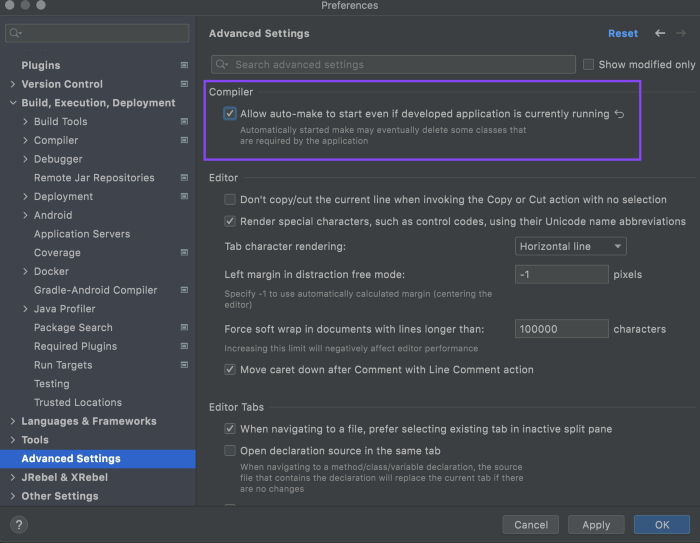
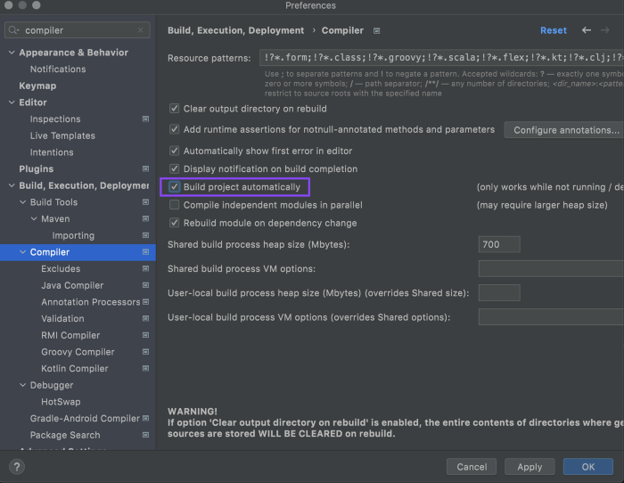

## Spring Boot Developer Tools and IntelliJ

Enable Spring Boot Developer Tools in IntelliJ

### 1. Add Spring Boot Developer Tools dependency

```xml
<dependency>
    <groupId>org.springframework.boot</groupId>
    <artifactId>spring-boot-devtools</artifactId>
    <optional>true</optional>
</dependency>
```

You can go to [Spring Devtools Properties docs page](https://docs.spring.io/spring-boot/docs/current/reference/html/application-properties.html#appendix.application-properties.devtools) for further details of more config properties. 
### 2. Change IntelliJ IDEA settings

#### 2.1 Enable <i>Allow auto-make to start even if the developed application is currently running</i>
Under <i>Settings | Advanced Settings | Compiler</i> section.



#### 2.2 Enable <i>Build project automatically</i>
Under <i>Settings | Build, Execution, Deployment | Compiler</i> section.

If you don't want to check this option, you can press ```CTRL + F9``` each time you make changes in your project.



#### 2.3 Update essential IntelliJ IDEA Registry options
First, open the Registry by press ```Ctrl + Shift + A``` or click on <b><i>Help | Find Action</i></b> menu, then search <i>Registry</i>.

Update all options below to specific values:
- <i>compiler.document.save.enabled: true (checked)</i> <br>Specify whether project save in response to document changes is enabled.
- <i>compiler.document.save.trigger.delay: 1500</i> <br>Delay in milliseconds before triggering save in response to document changes.
- <i>compiler.automake.postpone.when.idle.less.than: 50</i> <br>If at the moment the auto-build is about to start the IDE is idle for less than specified milliseconds, the automatic build will be postponed in order not to interfere with the user's activity.
- <i>compiler.automake.trigger.delay: 50</i> <br>Delay in milliseconds before triggering auto-make in response to file system events.

### 3. Happy coding!

Finally, click on <b><i>Build | Build Project</i></b> and <b><i>Run | Run</i></b> to trigger build and run process in IntelliJ IDEA.

You can also use [spring-boot-maven-plugin](https://docs.spring.io/spring-boot/docs/current/maven-plugin/reference/htmlsingle/) command to trigger the run process:
```shell
./mvnw spring-boot:run
```
Or:
```shell
./mvnw spring-boot:start
```

<i>Whenever you save your source code, the Devtools will restart application automatically.</i>  
