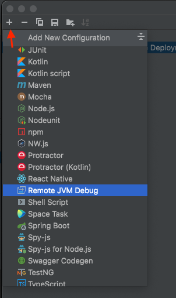
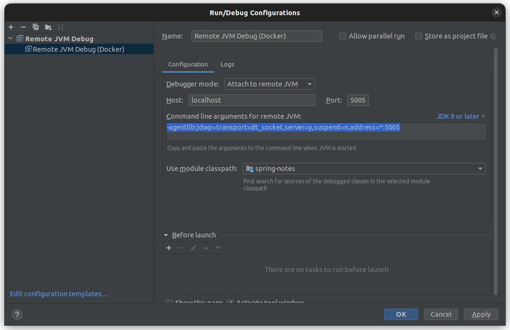
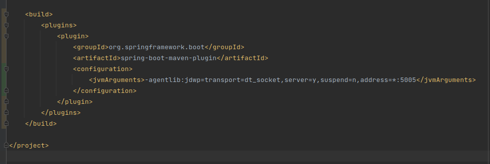
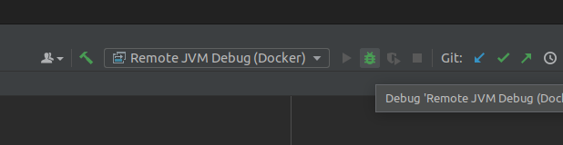
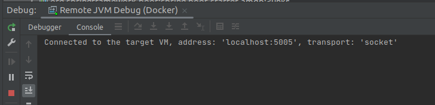
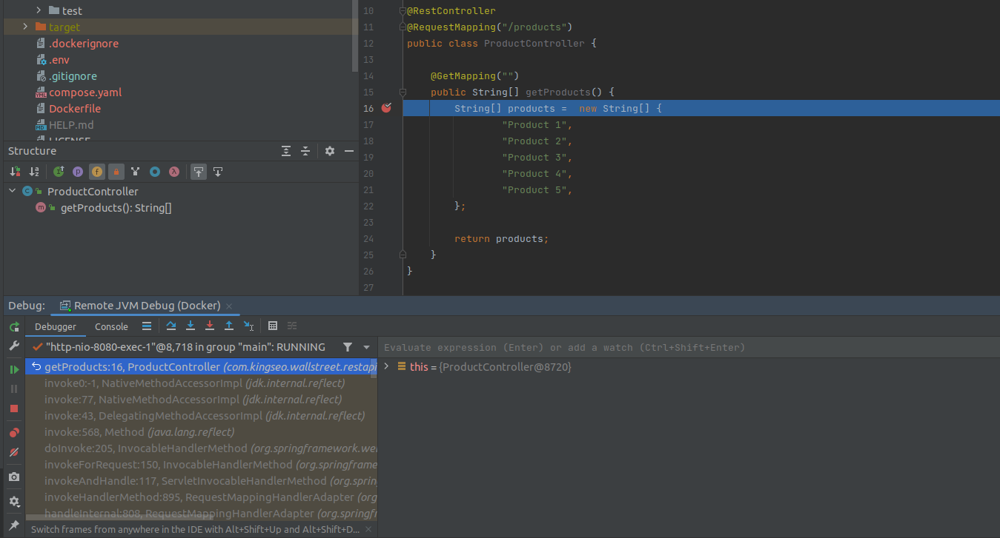

## Developing and Debugging Spring Boot Applications in Docker Compose
Setup Docker Compose for development and debug your Spring Boot Applications in IntelliJ IDEA

### 1. Enable Spring Boot Developer Tools
First, you have to [enable Spring Boot Developer Tools in IntelliJ](../devtools)

### 2. Install Docker and Docker compose plugin
If you already have Docker and Docker compose plugin in your local, please ignore this step.

Visit these Docker's official documents for more details:
- [Install Docker Engine](https://docs.docker.com/engine/install/)
- [Install Docker Compose](https://docs.docker.com/compose/install/)

### 3. Build Docker compose environment for development
Develop our code inside docker environment we will have:
- Still coding and debugging normally in IntelliJ IDEA.
- Avoid having to compile on local machine.
- Being able to automatically rebuild and restart the application whenever have any changes. All processes will be done inside docker container.

#### 3.1 Add a Dockerfile to your project's root directory
```dockerfile
FROM eclipse-temurin:17-jdk-jammy

ARG UID
ARG GID
ENV UID=${UID:-1000}
ENV GID=${GID:-1000}

RUN set -eux; \
    #
    # Add a non-root user
    #
    addgroup --system --gid ${GID} jellyfish; \
    adduser --system --disabled-login --ingroup jellyfish --home /home/jellyfish --gecos "JVM Executor" --uid ${UID} jellyfish; \
    [ ! -d /var/app ]; \
    mkdir -p /var/app; \
    chown jellyfish:jellyfish /var/app; \
    chmod 777 /var/app; \
    [ ! -d /home/jellyfish/.m2 ]; \
    mkdir -p /home/jellyfish/.m2; \
    chown jellyfish:jellyfish /home/jellyfish/.m2; \
    chmod 777 /home/jellyfish/.m2;

USER jellyfish
WORKDIR /var/app

EXPOSE 8080 5005

CMD ["./mvnw", "-DskipTests", "clean", "spring-boot:run"]
```

Within this Dockerfile:
- Creates a non-root user, ```jellyfish```, inside the container with a user's ID (UID) and group's ID (GID).
- Creates a directory to place source code if it doesn't exist, ```/var/app```.
- Prepares maven local repository directory, ```/home/jellyfish/.m2```.
- Instructs Docker to start the container with user ```jellyfish``` by default.
- Exposes port 8080 for application and 5005 for debugger.
- Finally, start the Spring Boot application when container is started.

<i>Run our container with a non-root user is recommended to void security risk.</i>

#### 3.2 Add a ```compose.yaml``` file to your project's root directory
```yaml
networks:
  backend:
    driver: bridge

volumes:
  maven-local-repo:
    driver: local

services:
  app:
    build:
      context: .
      dockerfile: Dockerfile
    container_name: spring-boot-app
    volumes:
      - .:/var/app
      - maven-local-repo:/home/jellyfish/.m2
    stdin_open: true
    tty: true
    networks:
      - backend
    ports:
      - "0.0.0.0:8080:8080"
      - "0.0.0.0:5005:5005"
    restart: always
```

Create a local network called ```backend```, so all services that are defined in this compose file will be able to access to others via container name instead of IP address.

Mounted a local volume, ```maven-local-repo```, into container directory ```/home/jellyfish/.m2```. This help the maven local repository inside container won't be lost when you restart the container.

The local source code directory is mounted into container at ```/var/app```. So, the source code changes will be sync between local machine and container.

Exposes ports ```8080``` ```5005``` to localhost:
- The application runs on port 8080.
- Port 5005 make the debugger available to the IntelliJ IDEA.

<i>For more details, please visit docker's official [compose specification](https://docs.docker.com/compose/compose-file/)</i>

At the project's root directory, you can use this command to build service images:
```shell
docker compose build
```

And then start all service containers with command
```shell
docker compose up
```

You can use ```-d``` option to start all containers in detached mode.
```shell
docker compose up -d
```

To see the application's log, you can use this command:
```shell  
docker compose logs -f app
```
With _app_ is our service name under ```services``` section in the ```compose.yaml``` file.

Here, we have done to start the development environment within docker.
The Spring Boot Devtools will rebuild and restart the application automatically when you save any changes of source code in the IntelliJ IDEA.
Visit your browser at ```http://localhost:8080``` to see awesome changes.

### 4. Debug application with IntelliJ IDEA

#### 4.1 Shutdown the running application first.
Your application is maybe running after you run ```docker compose up``` command before.
If that's right, you should turn it off fist by press ```Ctrl + C```
or run command ```docker compose down``` if you have started with ```-d``` option before.

#### 4.2 Add new "Remote JVM Debug" configuration

Open __Run/Debug Configurations__ dialog at __Run__ | __Edit Configurations...__ menu.

Then add a new __Remote JVM Debug__ configuration.



The default configuration should work. Here is a sample configuration:



Copy all command line arguments content under _Command line arguments for remote JVM_ section:

```shell
-agentlib:jdwp=transport=dt_socket,server=y,suspend=n,address=*:5005
```

You maybe notice that the TCP port ```5005``` we have exposed before is here.

#### 4.3 Add the command line arguments to _spring-boot-maven-plugin_
Add the command line arguments that you have copied to ```jvmArguments``` configuration of __spring-boot-maven-plugin__ inside ```pom.xml``` file.



Save all and start your application again by run command (maybe with ```-d``` option for detached mode):
```shell
docker compose up
```
After startup, the application will output log ```Listening for transport dt_socket at address: 5005``` in console.
Now the __Debugger__ is started correctly.

#### 4.4 Start debug in IDE
Now select your new remote debug configuration from the dropdown list and hit the debug button.



If the debug configuration is successful, then the console will output looks like:



Now add a breakpoint in your source code, save it, then access to your application. It should hit your breakpoint:



When you make some changes to the codebase. The Spring Boot Devtools will rebuild your application automatically.

_Happy coding!_
